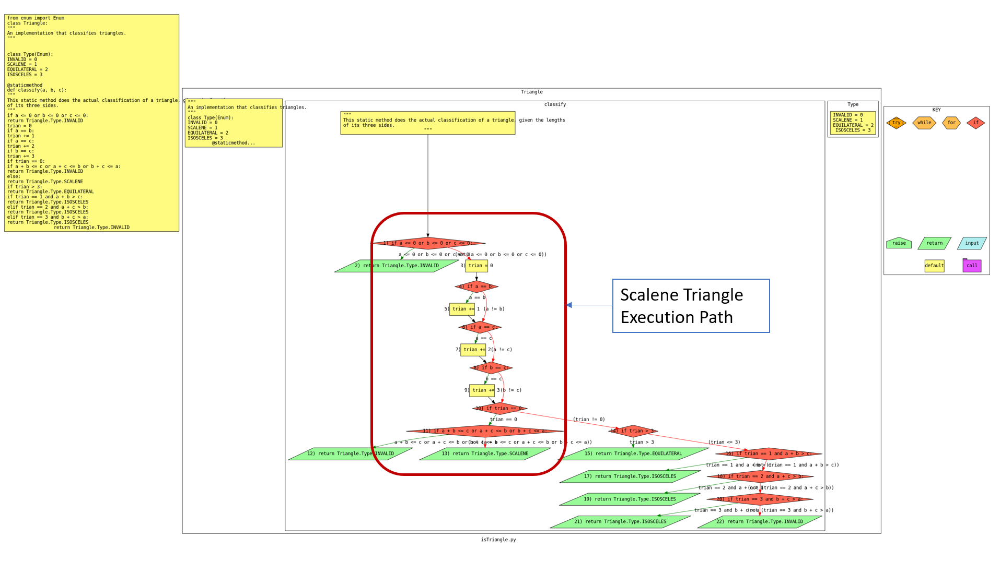

# IE2-Triangle
Template code for the In-Class Exercise 2 on Unit Testing, an exercise that focuses on unit testing and
test effectiveness, using code coverage and mutation analysis.

NOTE) In the following, we will be using the python 3 commands. You may instead need to use the python commands.

# Installation
We advise you to create a virtual enviroment (python venv, conda) to install the packages.

1. Run ```pip3 install -r requirements.txt.```
2. Test the setup by running 
  ```
   cd test_suit
   python3 -m test_isTriangle
   ```
3. Test the initial test suite by running the script: ```test.sh```

For more information on ```Pytest```, you can take a look at the homepage https://pypi.org/project/pytest/. 

Here are more details about ```unittest```: https://docs.python.org/3/library/unittest.html.


# Control Flow Graph



Control flow graph (CFG) helps to assess normative and exception cases from the execution flow. You are given the CFG of the file ```isTriangle.py```. One example normative case is identified for you in the provided image: ```scalene_triangle```.  For a scalene triangle, the execution flow starts at the "classify" function, evaluates the invalid and equality conditions, and then reaches the trian == 0 condition, where the triangle is classified as scalene.

You need to identify the following cases in a similar way:

1. Find the execution flow for two (2) other normative cases from the CFG file: equilateral triangle, and isosceles triangle
2. Find the execution flow for two (2) exceptional cases from the CFG file: invalid sides and violates triangle inequality


# Testing & Analysis

You will need to create three test suites and place the files in test_suit folder. The goal is to interpret code coverage and mutation analysis results. The test suites are as follows:

## Statement Coverage

1. You need to create a test suite namely ```test_statementCoverage.py```
2. Run the following script to generate line coverage report: ```./statement_coverage.sh```
3. The statement coverage should be approximately **95%** and above. 


## Decision Coverage

1. You need to create a test suite namely ```test_decisionCoverage.py```
2. Run the following script to generate branch coverage report: ```./decision_coverage.sh```
3. The decision coverage should be approximately **95%** and above. 

### Coverage Tool

- We will be using the ```Coverage``` tool to analyze statement
coverage and condition coverage. 
- Run the Coverage code analysis scripts (statement_coverage.sh),
  (decision_coverage.sh) and inspect the report it produces. 
- You will find the ```index.html``` inside the generated folders ```statement_html``` and ```decision_html``` respectively in ```'./test_suit``` directory. 
- USEFUL RESOURCES: To get more idea on how to read a Coverage report:
https://coverage.readthedocs.io/en/7.2.7/

## Mutation Testing
1. You need to create a test suite namely ```test_mutationAdequate.py ```
2. When you run the command './mutation.sh', you will find a log file ```mutation_output.log``` generated in the directory ```./test_suit```. Check the log file for generated mutants or error messages. 
3. The mutant detection ratio should be approximately **90%** and above. 

NB: python.exe command works for windows system. Use only python if you are working on a UNIX system.

### Mutation Tool

- Run the mutation analysis (mutation.sh) and inspect the set of killed mutants it reports
(mutation report.html/index.html). The generated files will be in the directory ```./test_suit/mutation_report.html```. 
- Check the output log for identifying generated mutants. This will help to create test cases. 
- USEFUL TIP: If a mutant is labeled survived in the mutation report.html/index.html file, your test suite did not catch (a.k.a. did not kill) that mutant. If a mutant is labeled killed, your test suite did
catch (kill) that mutant.

# Troubleshooting
If you encounter an error with ```if self.isAlive():``` from mutpy, do the following:
1. Open ```utils.py``` shown in the error message from the "mutpy" scripts in the installed directory. 
2. Go to the line ```if self.isAlive():```, shown in the error message
3. Make the following change: if self.isAlive(): becomes ```if self.is_alive():```


# Generating Control flow graph (OPTIONAL Reading)
If you are interested to generate the control flow graph we have used in this exercise yourself, you can follow these instructions. We have used the ```py2cfg``` package (https://pypi.org/project/py2cfg/) to generate control flow graph from the file ```isTriangle.py```. Note: Windows users may find that py2cfg has a specific dependency that only works in Unix system. In that case, please execute it in a UNIX virtual machine.

1. Use the following command to install the py2cfg library: ```pip3 install py2cfg --user```
2. Install graphviz for visualizing the generated CFG. In Ubuntu, you can use the following command:
```sudo apt install graphviz```. 
Link to the Graphviz download: https://graphviz.org/download/
3. If you have installed it, then the default command is:
```py2cfg isTriangle.py```. You should find a generated SVG file in the same directory.
4. In a web brower, open the generated SVG file to visualize the CFG.
